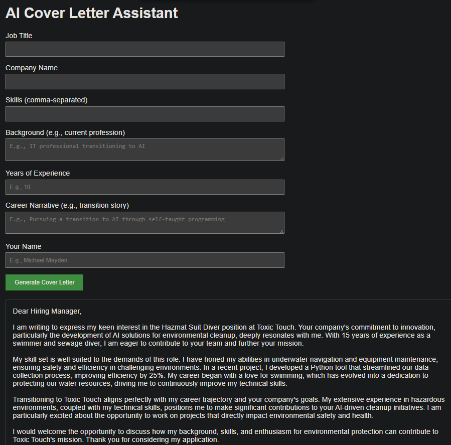

## Features
- Generate 200-250 word cover letters using xAI’s Grok API with tailored prompts.
- Store cover letters in SQLite with job title, company, skills, background, years of experience, career narrative, and timestamp.
- Display previous cover letters with formatted output and a "Download PDF" button.
- Export cover letters as professional PDFs with Calibri font, 12pt text, 1-inch margins, headers, date, recipient, and footer.

## Recent Improvements
- Fixed PDF truncation by implementing word wrapping and robust multi-page handling.
- Enhanced PDF layout with Calibri font, 14pt headers, 12pt body, 1.2x line spacing, and proper paragraph breaks.
- Added years of experience and career narrative inputs for personalized, high-quality cover letters.

## Screenshots
